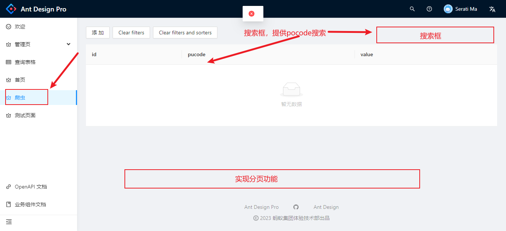

时间: 2023-01-09 13:06
标题: 新增前端分页接口

详细需求: 1.在侧边栏"爬虫"页中实现表单分页和搜索功能，

    参数：
    api地址: api/spider  //例子第二页: api/spider?page=2
    req:
    {
        page: 1 //当前页
        size: 10 //每页条数
        pucode: '京东'|| -1 //传-1是没有条件
    }
    res:
    {
        count: 45 //总数
        results: [
            {id: 1, pucode: '京东', value: '1'},
            {id: 2, pucode: '京东', value: '1'},
            {id: 3, pucode: '京东', value: '1'},
            {id: 4, pucode: '京东', value: '1'},
            {id: 5, pucode: '京东', value: '1'},
            {id: 6, pucode: '京东', value: '1'},
            {id: 7, pucode: '京东', value: '1'},
            {id: 8, pucode: '京东', value: '1'},
            {id: 9, pucode: '京东', value: '1'},
            {id: 10, pucode: '京东', value: '1'},
        ]
    }
